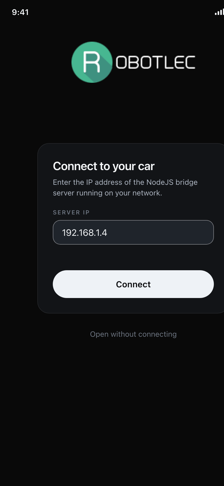
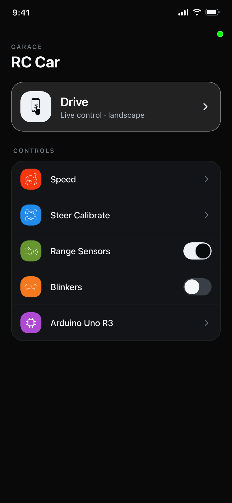
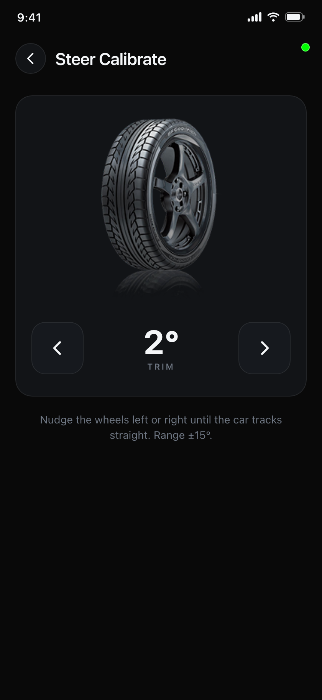
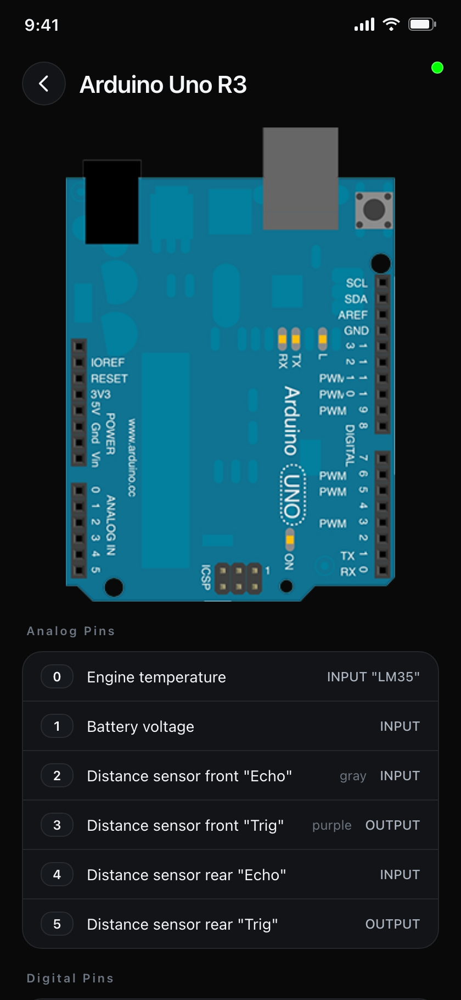
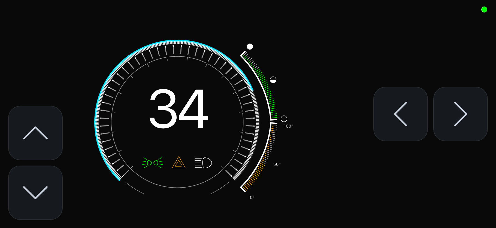

# RC Car - Mobile App

This is an example project that allows you to drive an RC car with a mobile app. Yes, of course you need to have a car able to communicate through Zigbee or Wifi for this to work.

Here on this page [www.robotlec.com](http://www.robotlec.com) you can see from where this project originated from, here you can still find the old code that was rewritten now. Phonegap app was rewritten in React Native and the web server was written in .NET using the SignalR library, which was replaced with simpler NodeJs and a Websocket library, so now you don't need a Windows server anymore to run it.

Code for React Native is written in a container component pattern style. The main purpose of this pattern is that you have the business logic and presentation components separate. 
Here you can read more on [this](https://medium.com/@dan_abramov/smart-and-dumb-components-7ca2f9a7c7d0)


| Connection Screen | Home Screen | Steer Calibrate | Arduino Settings |
| --- | --- | --- | --- |
|  |  |  |  |
| First you need to insert an IP address depending on where the NodeJs server is running. | Here from your home screen you can set additional setting for your RC car. | For this RC car I'm using a servo motor for left/right steering, and sometimes you need to calibrate the steering so that it goes perfectly straight. | Just some Arduino info for myself which helps me to know which wire is which. |
 
| Dashboard Drive Mode |
| --- |
|  |
| In the main driving mode, you drive with buttons. Here you have buttons for going forward/backward and from left/right, plus you have speedometer. |

## Getting Started

The app runs on **React Native 0.86**. Set up the RN toolchain (Android SDK / JDK)
by following the official [environment setup](https://reactnative.dev/docs/set-up-your-environment) guide.

Install the JS dependencies — a couple of legacy libs (`react-native-circular-progress`,
`react-native-event-listeners`) declare stale peer ranges, so this needs `--legacy-peer-deps`:
```
npm install --legacy-peer-deps
```

Copy `.env.example` to `.env` and set `WS_SERVER_IP` / `WS_PORT` to point at the
NodeJS bridge. The `.env` file is read at **build time** (via `ENVFILE=`), so
changing a value means a rebuild, not just a Metro reload (`.env.prod` is the
production config).

### Run the app

Start the Metro bundler, then build onto a device or emulator. The `android-*`
scripts pick the env file for you:

```
npm start                    # Metro bundler
npm run android-dev          # debug build (uses .env)
npm run android-prod         # build with .env.prod
npm run build-android-prod   # assemble a release APK
```

> The app is developed and shipped for **Android** (see [ANDROID_UPGRADE.md](ANDROID_UPGRADE.md)
> and the APK build in CI). An `npm run ios` script exists, but iOS is not part of
> the current toolchain or CI.

### NodeJS server (websocket bridge + simulator)

The server is the bridge between the app and the car's Arduino. It now ships a
**car simulator**, so you can run and "drive" the whole stack with **no hardware**.

From the `node_server` sub-folder:

```
npm install
npm run dev        # hot-reload; simulator on by default (SIMULATE=true)
```

Or fully isolated in Docker, from the repo root:

```
docker compose up --build      # bridge + simulator on :8085
```

To talk to a **real car** instead of the simulator, run on the machine wired to
the Arduino with the serial port configured:

```
SIMULATE=false SERIAL_PATH=/dev/ttyUSB0 SERIAL_BAUD=19200 npm start
```

See `node_server/.env.example` for all options. The server is TypeScript, typed,
and covered by tests (`npm test`) and CI.

### The car firmware (Arduino)

This is the **third tier** — the code that actually runs on the car. It lives in
[`arduino/rc-car/rc-car.ino`](arduino/rc-car/rc-car.ino) and targets an **Arduino Uno**.
The bridge server (above) relays every WebSocket message to it over the serial port,
so the Arduino never talks to the app directly.

> **You can't build or flash this from the repo** — there's no Arduino toolchain here
> (the project's `npm` scripts are for the app/server only). Flash it with the
> **Arduino IDE, on the machine that's physically wired to the car.** The previous
> version of this sketch is preserved in git history as a fallback if a change
> misbehaves on real hardware.

**1. Install the libraries** (Arduino IDE → *Tools → Manage Libraries…*):

| Library | Source |
| --- | --- |
| `Servo` | bundled with the Arduino IDE (no install) |
| `Wire` | bundled with the Arduino IDE (no install) |
| `SimpleTimer` | install via Library Manager |
| `NewPing` | install via Library Manager |

**2. Flash it:** open `arduino/rc-car/rc-car.ino`, set *Board → Arduino Uno* and
*Port →* the Uno's port, then **Upload**. The car communicates at **19200 baud** —
the same value the bridge uses as `SERIAL_BAUD`.

**3. Point the bridge at it:** on the wired machine, run the server with the
simulator off (see the section above):
```
SIMULATE=false SERIAL_PATH=/dev/ttyUSB0 SERIAL_BAUD=19200 npm start
```

**Pin map** (matches the in-app *Arduino Settings* screen — "which wire is which"):

| Digital | Role |
| --- | --- |
| D2 | Speed pulse — INT0 interrupt, counts RPM |
| D3 | Direction sense (forward / reverse) |
| D4 | High beams (long lights) |
| D5 | Underbody light, red (PWM) |
| D6 | Underbody light, blue (PWM) |
| D7 | Left blinker |
| D8 | Right blinker |
| D9 | Steering servo (left / right) |
| D10 | Front range-sensor sweep servo |
| D11 | Drive servo / ESC (forward / backward) |
| D12 | Headlights |
| D13 | Brake / stop lights |

| Analog | Role |
| --- | --- |
| A0 | Motor temperature (LM35) |
| A1 | Battery voltage (divider) |
| A2 | Front ultrasonic — echo |
| A3 | Front ultrasonic — trig |
| A4 | Rear ultrasonic — echo |
| A5 | Rear ultrasonic — trig |

**The wire protocol** is the 2-character-code scheme defined in
[`shared/protocol.ts`](shared/protocol.ts) (app → car ends in `\n`, car → app ends in `X`).
The app drives via the on-screen **buttons** (`dv` drive state); `sc`/`rc` trim the steering and
range-sensor servos; the car streams `sp`/`bv`/`mt` telemetry plus `rs` when the front
obstacle brake engages. *(The old accelerometer drive mode `dm`/`ad`/`as` was removed —
the firmware and protocol now match what the app actually sends.)*

**Safety mechanisms baked into the firmware** — understand these before changing them:

- **Motion lease** — the app streams the absolute drive state (`dv<throttle><steer>`)
  every 150 ms while a control is held; a non-neutral throttle is only honoured for
  ~600 ms since the last frame, then the car coasts to neutral. There is no
  keep-alive: nothing can keep the car moving except the operator's finger,
  restated a few times a second. This is the main safety net.
- **Motor-temperature cutoff** — the car stops if the LM35 (A0) reads ≥ 50 °C.
- **Obstacle brake** — the front ultrasonic brakes when something is within
  `speedFactor × 2.4` cm while moving forward; the rear ultrasonic blocks reversing.

> **Calibration is car-specific.** The servo angles (90 = neutral, `sf` = forward
> throttle, 15 = reverse, ± steer/range trim) and the speed scaling
> (`rpm × 0.245 × 0.06`) were tuned to *this* physical car. Re-measure on the bench
> if you change them, and re-test the safety stops after every flash.

### Checking logs & monitoring connections

Every connection event on **both** legs — the **app ↔ server** WebSocket and the
**server ↔ car** serial link — is logged with a timestamp, so you can see *what*
failed and *when*.

**In the app:** a small **connection dot** sits in the top-right corner of every screen:

| Colour | Meaning |
| --- | --- |
| ⚪ grey | not connected / opened offline |
| 🟠 orange | connecting… |
| 🟢 green | connected to the server |
| 🔴 red | connection failed or dropped |

**Tap the dot** to open the **Diagnostics** screen — a timestamped log of every
connect/disconnect on the phone (persisted across restarts; "Clear" to reset).

**On the server**, logs go three places:

1. **Console** (pretty lines) — e.g. with Docker:
   ```
   docker compose logs -f rc-car-server
   ```
2. **JSON-lines files**, one per day, under `node_server/logs/` (set with `LOG_DIR`;
   `LOG_DIR=` empty disables file logging). Query with standard tools:
   ```
   tail -f node_server/logs/bridge-$(date +%F).jsonl
   grep -E '"level":"(warn|error)"' node_server/logs/*.jsonl | jq .   # only problems
   ```
3. **HTTP endpoints** on the same port as the WebSocket — check from a terminal,
   a browser, or the phone:
   ```
   curl http://<server-ip>:8085/health
   curl "http://<server-ip>:8085/logs?limit=100&level=warn"
   ```
   - `GET /health` → status, connected clients, uptime, and time since the last telemetry frame.
   - `GET /logs?limit=N&level=info|warn|error` → the most recent structured log entries as JSON.

Set verbosity with `LOG_LEVEL` (`debug` | `info` | `warn` | `error`; default `info`).

**Verbose tracing.** To watch *every* command and telemetry frame as it crosses
both legs — and see **which app** sent each command — run the server in verbose
mode. From the `node_server` sub-folder:

```
npm run dev:verbose          # recommended: hot-reload + full frame tracing
```

Other ways to switch it on (all equivalent):

```
npm run dev -- --verbose     # ad-hoc flag
npm run dev --verbose        # also works (noisier: npm prints its own logs too)
VERBOSE=true npm run dev      # via env / .env
VERBOSE=true npm start        # no hot reload
```

Verbose forces `LOG_LEVEL=debug` and adds one decoded line per frame:

```
DEBUG [ws]     app_to_car — #1 192.168.1.5:54213 -> car   cl1   (CAR_LIGHTS)
DEBUG [ws]     app_to_car — #2 192.168.1.5:54880 -> car   bl1   (BLINKERS)
DEBUG [serial] car_to_app — car -> apps   sp42  (SPEED)
```

- Each client is labelled `#N <ip>:<port>`, so two connected apps are easy to tell apart.
- Codes are decoded to names from `shared/protocol.ts` (`cl` → `CAR_LIGHTS`, `sp` → `SPEED`, …).
- The `dv` drive-state refresh (re-asserted several times a second while a control
  is held) is logged only when the value changes, plus a periodic `(DRIVE_STATE xN)`
  summary while it repeats, so state changes stay easy to spot.

> `LOG_LEVEL=debug` on its own does **not** show these per-frame traces — they are
> only generated in verbose mode. `LOG_LEVEL` sets the severity threshold;
> `--verbose` turns on the frame-by-frame tracing (and bumps the level to `debug`).

**What to look for:**

- `client_connected` / `client_disconnected` (with IP + close code) — the app ↔ server leg.
- `link_error` / `link_closed` — the server ↔ car serial leg.
- `telemetry_gap` — the car stopped sending data while someone was connected (off,
  unplugged, or serial down); `telemetry_resumed` when it returns.

> The `/health` and `/logs` endpoints are **unauthenticated and LAN-only**, like the
> WebSocket itself — don't expose the server to the public internet.

### The React Native upgrade

The app was upgraded from React Native 0.54 (2018) to **React Native 0.86**
(TypeScript + hooks + React Navigation v7). The complete, step-by-step migration
record — including the Apple-Silicon `aapt2` caveat for building the APK locally —
is documented in [ANDROID_UPGRADE.md](ANDROID_UPGRADE.md).